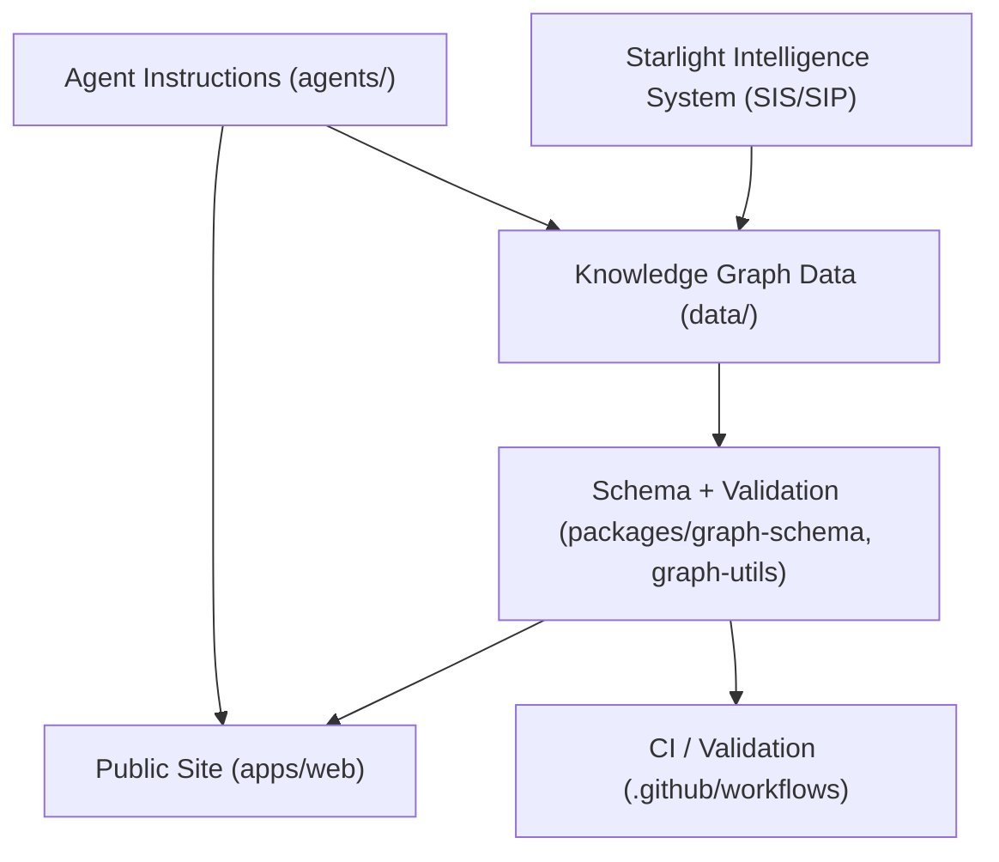

# Architecture

## Overview

Starlight Knowledge Tree is a typed, evidence-first knowledge graph. It is organized as a monorepo with shared data, a validation layer, and a public-facing web application.

```
starlight-knowledge-tree/
  data/           ← the graph: domains, nodes, schemas
  packages/       ← shared TypeScript libraries
    graph-schema/ ← Zod schemas for nodes, edges, paths
    graph-utils/  ← graph traversal and validation utilities
  apps/
    web/          ← Next.js public site
  agents/         ← agent instruction files
  docs/           ← human documentation
  .github/        ← CI, issue templates
```

---

## Layer Diagram



---

## Data Layer

The graph lives in `data/` as flat JSON files. This keeps it:

- **Human-readable** — contributors can propose changes via PRs without tooling
- **Diff-friendly** — JSON arrays produce clean, reviewable diffs
- **Schema-validated** — every file is checked against `data/schemas/` on CI

### File Structure

```
data/
  domains/
    ai-architect.json         ← domain metadata + paths + seed nodes
    space-builder.json
    bio-human-intelligence.json
    creator-founder.json
  nodes/
    concepts.json             ← all concept nodes
    skills.json               ← all skill nodes
    tools.json                ← all tool nodes
    papers.json               ← all paper nodes
    experiments.json          ← all experiment nodes
    artifacts.json            ← all artifact nodes
    open-problems.json        ← all open problem nodes
    contribution-tasks.json   ← all contribution task nodes
  schemas/
    node.schema.json          ← JSON Schema for a node object
    edge.schema.json          ← JSON Schema for an edge object
    path.schema.json          ← JSON Schema for a skill path
```

---

## Schema Layer

Schemas live in two places:

1. **`data/schemas/`** — JSON Schema files used by the CI validator and IDE linting
2. **`packages/graph-schema/`** — Zod schemas for TypeScript runtime validation in `apps/web` and `packages/graph-utils`

The two representations are kept in sync. The JSON Schema is the source of truth; the Zod schema is derived from it.

---

## Validation Layer (`packages/graph-utils`)

The graph validator:

1. Parses all node files against `data/schemas/node.schema.json`
2. Checks that all edge `target` IDs resolve to existing node IDs
3. Detects circular `requires` chains
4. Verifies all `skill` nodes have at least one `evidence_type`
5. Verifies all `paper` nodes have a `url` and `year`
6. Outputs a summary report and exits non-zero on errors

Run locally:

```bash
npm run validate
```

Run in CI: see `.github/workflows/validate-graph.yml`

---

## Web Application (`apps/web`)

A Next.js App Router application with the following routes:

| Route | Page |
|---|---|
| `/` | Manifesto and hero |
| `/tree` | Visual knowledge graph overview |
| `/paths/[domain]` | Skill path explorer for a domain |
| `/research` | Root-node open problems and research radar |
| `/contribute` | How to add nodes and quests |
| `/about` | Built on Starlight Intelligence Protocol |

### Design Language

- Background: deep navy `#0A0E1A` / near-black
- Primary accent: cyan `#00D4FF`
- Authority accent: amber/gold `#F5A623`
- Typography: white, Inter or Geist
- Cards: liquid-glass (backdrop blur, semi-transparent borders)
- Grid/blueprint substrate texture on hero sections

---

## Agent Layer (`agents/`)

Agent instruction files tell AI coding assistants (Claude Code, GitHub Copilot, Cursor, Codex) how to operate on this repository. Each agent has a specific role and a set of rules it must follow. See `docs/agent-operating-rules.md` for the global rules that apply to all agents.

---

## Relationship to SIS/SIP

Starlight Knowledge Tree is a **vertical** of the Starlight Intelligence System. It does not implement:

- SIS protocol or memory vaults
- MCP tool definitions
- Agent orchestration infrastructure
- Sovereign identity primitives

It consumes these as a substrate. The integration point is defined in `docs/integration-with-sis.md`.
